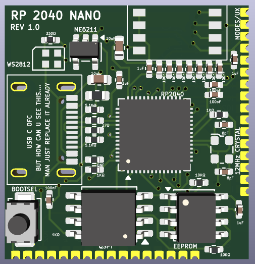

# RP2040 Nano

Compact 4-layer RP2040 development board built for embedded experimentation, expansion, and practical tinkering.



---

## Features

- RP2040 microcontroller
- USB-C connectivity
- QSPI flash
- EEPROM support
- BOOTSEL button
- WS2812B-2020 RGB STATUS LED
- ME6211 LDO
- 4-position DIP switch
- Polyfuse protection
- 12MHz crystal
- Castellated GPIO breakout
- Compact 24.5mm × 25.5mm 4-layer PCB

---

## PCB Preview

| Front | Back |
|---|---|
|  |  |

---

## Current Status

- PCB manufactured
- Rev1 completed
- Awaiting assembly/testing
- Future revisions planned

---

## What I Learned

- 4-layer PCB routing
- Compact layout optimization
- USB-C implementation basics
- QFN and 0402 footprint handling
- KiCad workflow fundamentals

---

## Future Plans

- Rev2 improvements
- Full board assembly/testing
- Firmware examples
- Daughterboard ecosystem ideas

---

## Project Structure

```text
Hardware/
Firmware/
Images/
Docs/
